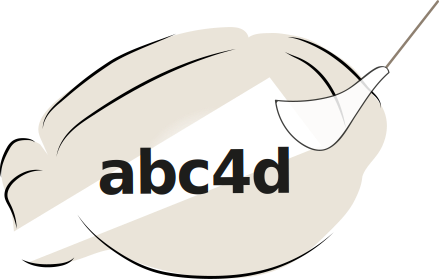
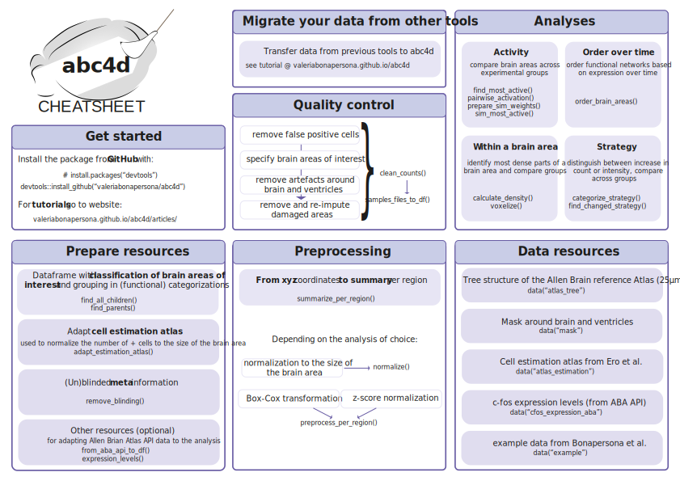

# abc4d

<!-- badges: start -->

# [](https://github.com/valeriabonapersona/abc4d/actions)
<!-- badges: end -->

abc4d is a pipeline to preprocess and analyze whole-brain microscopy data (over time). You have identified your active cells and aligned them to an atlas and wonder "What next?", **abc4d** is the place where to start. 


<br>
<p align="center">
  
</p>
<br>

abc4d has functions for: 
1) quality control, 
2) preprocessing, and 
3) analyses from the macro- to micro- scale. 

The resources offered within the package are in alignment of the Allen Brain Reference Atlas. However, for most functions these can be easily substituted.


## Get started

You can install the released version of abc4d from [github](https://github.com/valeriabonapersona/abc4d) with:

``` r
#If you do not have devtools yet:
#install.packages("devtools")

devtools::install_github("valeriabonapersona/abc4d")
```

All dependencies will be automatically downloaded.


## Tutorials
See 'Articles'. 

<br>
<p align="center">
  
</p>
<br>


``` r
library(abc4d)
## basic example code
```

More thorough tutorials are available [here](google.com). You can also see [this repository](https://github.com/valeriabonapersona/footshock_brain) for a thorough analysis example using the abc4d package.


## Project organization
This package was created with [devtools](https://cran.r-project.org/web/packages/devtools/index.html) and it follows the recommended organization.

```
.
├── .gitignore
├── CITATION.md
├── LICENSE.md
├── README.md
├── DESCRIPTION
├── NAMESPACE
├── R                     <- Source code of all functions
├── img                   <- Images for readme
├── man                   <- Automatically generated by roxygen2
├── tests                 <- Automatically generated by test_that
│   └── testthat          <- Tests to run on the functions
│   ├── final             <- The final, canonical data sets used for analyses. 
│   ├── raw               <- The original data, directly downloaded from the repository. 
│   └── temp              <- Intermediate data.
└── renv


```

## Known bugs
Nothing so far!

<br>

## License
This project is licensed under the terms of the [MIT License](/LICENSE.md).

<br>

## Citation
Please [cite this project as described here](/CITATION.md).

<br>

## Acknowledgements
* Heike Schuler for her collaboration in determining quality control and preprocessing steps
* Keving Kemna for suggesting making this package
