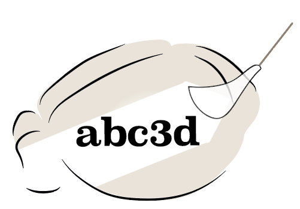

# abc3d
<!-- badges: start -->


<!-- badges: end -->

abc3d is a pipeline to preprocess and analyze your 3D microscopy data. You have identified your active cells and aligned them to an atlas and wonder "What next?!", **abc3d** is the place where to start. 


<br>
<p align="center">
  
</p>
<br>

abc3d has functions for: 
1) quality control, 
2) preprocessing, and 
3) analyses from the macro- to micro- scale. 

The resources offered within the package are in alignment of the Allen Brain Reference Atlas. However, for most functions these can be easily substituted.


## Get started

You can install the released version of abc3d from [Bioconductor](https://www.bioconductor.org) with:

``` r
#Joking, it's not there yet. You can download directly from github. 
# to do that, you need devtools. If you do not have devtools yet:
#install.packages("devtools")

devtools::install_github("valeriabonapersona/abc3d")
```

All dependencies will be automatically downloaded.

<br>

If you do not have bioconductor yet, you can install the latest release with:

``` r
if (!requireNamespace("BiocManager", quietly = TRUE))
    install.packages("BiocManager")
BiocManager::install(version = "3.12")
```

or check out the bioconductor [installation page](https://www.bioconductor.org/install/).

## Tutorials

This is a basic example which shows you how to solve a common problem:

``` r
library(abc3d)
## basic example code
```

More thorough tutorials are available [here](google.com). You can also see [this repository](https://github.com/valeriabonapersona/brain_after_footshock) for a thorough analysis example using the abc3d package.


## Project organization
This package was created with [devtools](https://cran.r-project.org/web/packages/devtools/index.html) and it follows the recommended organization.

```
.
├── .gitignore
├── CITATION.md
├── LICENSE.md
├── README.md
├── DESCRIPTION
├── NAMESPACE
├── R                     <- Source code of all functions
├── img                   <- Images for readme
├── man                   <- Automatically generated by roxygen2
├── tests                 <- Automatically generated by test_that
│   └── testthat          <- Tests to run on the functions


│   ├── final             <- The final, canonical data sets used for analyses. 
│   ├── raw               <- The original data, directly downloaded from the repository. 
│   └── temp              <- Intermediate data.
└── renv


```

## Known bugs
Nothing so far!

<br>

## License
This project is licensed under the terms of the [MIT License](/LICENSE.md).

<br>

## Citation
Please [cite this project as described here](/CITATION.md).

<br>

## Credits and acknowledgements
* Marian Joels and Angela Sarabdjitsingh for the impeccable supervision
* Heike Schuler for her collaboration in determining quality control and preprocessing steps
* Keving Kemna for suggesting making this package
