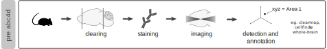
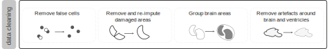

```{r setup, include=FALSE}
#knitr::opts_knit$set(root.dir = '/tmp')
knitr::opts_knit$set(root.dir = "..")
knitr::opts_chunk$set(echo = T, eval = FALSE, results = "hide")
```

## Pre-abc4d
You have performed your whole-brain experiment, imaged the brains, and processed the samples for cell identification and annotation. Probably something along the lines of: 



Have you used *clearmap* or *cellfinder*? Ultimately you reached a matrix where each row is one cell, and each column represents: 

- **xyz coordinates**, one column for each
- **id**, indicating the Allen Brain Reference Atlas (ABA) area that the cell belongs to
- **manimum intensity**, of the cell (not yet available in cellfinder).


Save this matrix for each sample as a .npy file. For a clearmap example, see [this repository](https://github.com/heike-s/clearmap_processing). Alternatively, download our sample data on [our osf page](https://osf.io/j2sxf/).


### Environment preparation
First, let's make sure that we have all our environment properly set. 

```{r message=FALSE, warning=FALSE}
# To clean your environment, run
rm(list = ls())

# get your libraries
library(tidyverse) # for general data handling
library(abc3d) # for the analyses
library(RcppCNPy) # access numpy files in R

```

You can place this at the beginning of your script. Normally, I save this in a utils.R file in my src directory ("src/utils.R"). You can then source this file in at the beginning of your script. 

Then, I set my paths. These are folders where I save my data and resources

```{r}
data_raw <- "data/for_package/raw/"
data_temp <- "data/for_package/temp/"
data_final <- "data/for_package/final/"
resources <- "data/for_package/resources/"
```

Normally, I place this in a "config/config.R" file, but feel free to simply place it in just one single file. Make sure that the folders you refer to actually exist!

### Migrating data from other tools
chances are that the tool that you used for cell detection and alignment was in python. 
Next, lets have a look at one of our samples

```{r load sample}
# get the names of the npy files
my_npy <- list.files(data_raw)

# import npy of specified sample
sample_file  <- paste0(data_raw, my_npy[[1]])

# load .npy as a dataframe
raw_counts   <- as.data.frame(RcppCNPy::npyLoad(sample_file))

# rename columns: 
# column order/presence depends on the software used for annotation / alignment
colnames(raw_counts)    <- c('xPos', 'yPos', 'zPos', 'minInt',
                             'meanInt', 'maxInt', 'id')

# let's have a look at the data.frame
head(raw_counts)
```

  
### Preparing resources
The abc4d package provides the function clean_counts() for the data cleaning step of the analysis.




clean_counts() processes one sample (data.frame) at the time. It saves the cleaned cells and a summary of the removed cells in specified folders (path_cleaned and path_removed, respectively). 
clean_counts() requires resources (see vignette). These were prepared in advance, and are available as .csv files here (https://osf.io/j2sxf/).

```{r prepare_resources}
# file with all samples and group they belong to
conditions  <- read.csv(paste0(resources, "conditions.csv")) # file with all samples

# tree structure of the ABA categorization, with a variable (my_grouping) with the wanted spatial resolution - see vignette
areas   <- read.csv(paste0(resources, 'areas.csv'))

# if you do not want the smallest categorization of the aba atlas, you can simply:
# areas <- data("atlas_tree") # this comes from the ABA atlas
# areas$my_grouping <- areas$acronym

# damaged brain areas
damaged_ba  <- read.csv(paste0(resources, "damaged_ba.csv")) 

# cells with abnormally high values > here it's empty
dodgy_cells <- read.csv(paste0(resources, "dodgy_cells.csv"))

# masks for artefacts - available within the package. 
mask <- data("mask")
halo_correction <- mask[["halo"]]
ventricle_correction <- mask[["ventricle"]]

```

**Of note**, if you want to create your own mask, see [example script here](https://github.com/valeriabonapersona/footshock_brain/tree/main/py).


### Cleaning one sample
Now, we can clean the first sample.

```{r}
i <- my_npy[[1]]

# Import npy of specified sample
sample_file  <- paste0(data_raw, i)

# get sample name as saved in the sample_id vars
sample <- i %>% 
  str_remove_all(".npy") %>% 
  str_remove_all("sample_")

# prepare dataframe
raw_counts   <- as.data.frame(RcppCNPy::npyLoad(sample_file))
colnames(raw_counts)    <- c('xPos', 'yPos', 'zPos', 'minInt',
                             'meanInt', 'maxInt', 'id')

# Clean one sample
clean_cells <- clean_counts(sample_id = sample, data = raw_counts,
                            atlas = areas, damaged_areas = damaged_ba,
                            dodgy_cells = NULL,
                            out_mask = halo_correction, vent_mask = ventricle_correction,
                            path_cleaned = data_temp, 
                            path_removed = data_temp)
```

Check that two files were saved in the specified folders. In this example, two files should be saved in data/temp/.

### Cleaning all samples
Now for all samples.
```{r}

for (i in my_npy) {
  # Import npy of specified sample
  sample_file  <- paste0(data_raw, i)
  
  # get sample name as saved in the sample_id vars
  sample <- i %>% 
    str_remove_all(".npy") %>% 
    str_remove_all("sample_")
  
  # prepare dataframe
  raw_counts   <- as.data.frame(RcppCNPy::npyLoad(sample_file))
  colnames(raw_counts)    <- c('xPos', 'yPos', 'zPos', 'minInt',
                               'meanInt', 'maxInt', 'id')
  
  # Clean one sample
  clean_cells <- clean_counts(sample_id = sample, data = raw_counts,
                              atlas = areas, damaged_areas = damaged_ba,
                              dodgy_cells = NULL,
                              out_mask = halo_correction, vent_mask = ventricle_correction,
                              path_cleaned = data_temp, 
                              path_removed = data_temp)
}

```

Two files for each sample have been saved in the specified folder. 

### Get the final dataframe
Now, we can merge all cleaned samples in one single file. To do this, we can use the abc4d function samples_files_to_df. Here, you simply need to specify the folder where the cleaned samples are, and the function will merge them in a single dataframe.

```{r}
all_cells <- samples_files_to_df(data_temp)

# save output
saveRDS(all_cells, paste(data_final,"example.RDS"))
```

If you run the tutorial with the provided data, all_cells is equivalent to data("example") from the abc4d package.

