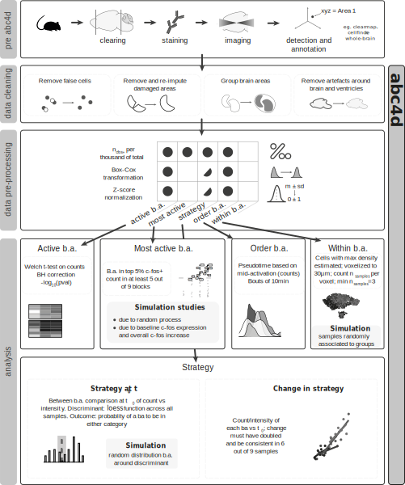

```{r setup, include=FALSE}
#knitr::opts_knit$set(root.dir = '/tmp')
knitr::opts_knit$set(root.dir = "..")
knitr::opts_chunk$set(echo = T, eval = FALSE, results = "hide")
```


## abc4d

abc4d (Analysis of Brain Cells in 4D) facilitates data cleaning, pre-processing and analysis of whole-brain microscopy data (over time). To get started, you can install abc4d from github. 

```{r install, message=FALSE, warning=FALSE}
# install devtools if not yet available
# install.packages("devtools")

devtools::install_github("valeriabonapersona/abc4d")
```

For a visual summary of all functions, see the [cheatsheet](https://github.com/valeriabonapersona/abc4d/blob/main/man/figures/cheasheet.png).


**Of note**, the data resources provided are based on the Allen Brain Reference Atlas, and the use of the Clearmap software for cell annotation. These can be substituted by using the atlas of interest in the resource preparation step, see vignettes and tutorials for more details.

## Overview of the abc4d pipeline


## Tutorials
Tutorials are currently under development. You can find them in 'Articles'. For a thorough analysis using the abc4d package, see [this project repository](https://github.com/valeriabonapersona/footshock_brain).
